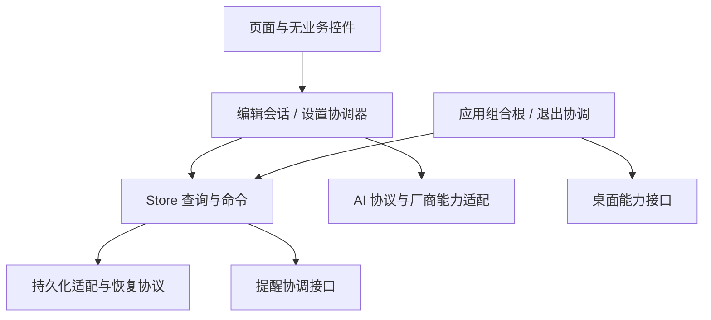

# Flutter 全库审查与开源准备评估

日期：2026-09-22。审查基线：`main / 9c622fd` 加接手时已有的 R1–R5、S1 修复与回归，**不是干净 HEAD**。对应执行文档：[开源准备实施计划](IMPLEMENTATION_PLAN_2026-09-22_OPEN_SOURCE_READINESS.md)。本轮只审查、记录和添加合成反例，不修改产品实现，不提交、不打包、不发布。

## 1. 结论与用户需求

用户最新反馈：实机总体没有大问题，除下述四项外可以结束本轮体验返修。接受这一判断，不重新开启全局 UI 设计。该反馈属于用户总体实测结论，不等于逐项记录了旧 UX08 的全部设备、尺寸和场景。

**当前代码已具有可维护的开源项目基础，但还不能把它描述为经过完整稳定性验证的正式发行版。建议进行一轮有边界的修复，不建议重写。** 主要短板是数据失败恢复、配置与平台接口的结果契约，以及公开协作需要的工具链、CI 和文档。高内聚低耦合只在部分模块成立；Store、设置页、详情编辑器和桌面壳仍承担过多职责。

开源没有统一的“代码达标证书”。公开源码、允许外部贡献与发布面向普通用户的稳定二进制，门槛不同：架构优化和性能实验不应无限阻塞公开源码；已经复现的数据损坏和操作错误，应在宣称稳定版之前修复。密钥/历史/许可证检查、真实构建说明和问题披露应在公开仓库前完成。本次没有证明仓库历史完全无敏感信息。

| 用户事项 | 审查结论 | 实施包 |
|---|---|---|
| 全部去掉斜体 | Flutter 生产源码有两处显式斜体，均为空状态文案；取消并检查主题继承 | OS01 |
| 父文字、复选框明显大于子项 | 卡片文字已有 16/14 区分；复选框只改变外部 SizedBox，未改变 Material 实际绘制尺寸，用户观察有代码依据；搜索/详情也要核对一致性 | OS02 |
| 默认模型改为 deepseek-flash | 更新默认与显示文案，保留旧备份读取；同时修正模型解码会误改自定义模型的问题 | OS03 |
| JSON 是否最优 | 对当前本地层级任务备份，继续采用版本化 JSON 合理；主要问题在导入校验、恢复与密钥处理，而非扩展名 | OS04、OS05–09 |

DeepSeek 官方当前建议使用 `deepseek-flash`；旧 `deepseek-v4-flash` 仍可调用并路由到新的 Flash 模型。因此这是默认值与兼容策略更新，不能写成“旧名称已完全不能调用”。[官方首次调用文档](https://api-docs.deepseek.com/zh-cn/)

## 2. 范围、证据与限制

覆盖 `matrixflow-native/lib` 全部 **40 个 Dart 文件，基线约 17,492 行**；沿启动、CRUD/撤销、导入导出、AI 配置与调用、提醒、桌面退出、编辑草稿和动画焦点进行交叉阅读；同时检查现有测试、集成测试入口、pubspec/lock、Android/Windows 工程、发布脚本与 CI。旧 React/Tauri/Capacitor 仅核对冻结边界，没有做旧端审查。

| 检查 | 结果 | 可作出的判断 |
|---|---|---|
| `flutter test --no-pub --reporter expanded` | **359/359 通过** | 已有默认回归通过，不代表异常边界完整 |
| `flutter analyze --no-pub` | **0 issues**（基线及新增探针后的最终复跑均通过） | 静态检查通过，不能证明架构解耦或持久化可靠 |
| 新增显式审查探针 | **7 个预期行为断言全部失败，7/7 反例复现** | 下表七条问题有运行证据 |
| Android/Windows 新构建、真机、真实收费 AI | 本轮未执行 | 不能替代用户实测，也不声称重新验收通过 |
| Git 敏感文件名检查 | 已跟踪路径中未见 jks/keystore/key.properties/.env/local.properties/release_dist 命中 | 仅文件名检查；不是内容、全历史、依赖漏洞或资源版权审计 |

运行使用 `D:/Dev_SDKs/Flutter_SDK`：Flutter `3.31.0-1.0.pre.88`、revision `082a761570`，Dart `3.8.0-197.0.dev`。CI 选 moving stable，两者不一致。测试与探针执行于本轮跨日审查期间；接手 Agent 必须用自己的实际结果更新，不能复制旧数字。

新探针：[preopensource_review_probe.dart](../matrixflow-native/test/review/preopensource_review_probe.dart)。全部使用 mock、合成数据和假 HTTP，不读取用户任务、不调用商业 API。文件故意不以 `_test.dart` 结尾，修复后将对应断言迁入默认回归，不要把断言倒改成接受错误。

```powershell
cd D:/Dev_project/martix/matrixflow-native
& D:/Dev_SDKs/Flutter_SDK/bin/flutter.bat test --no-pub test/review/preopensource_review_probe.dart --reporter expanded
```

| 探针 | 实际反例 | 对应问题/包 |
|---|---|---|
| OS-R01 | 启动读取损坏任务 JSON 后，原始字符串被写成 `[]` | F01 / OS05 |
| OS-R02 | 同一父项内重复且内容冲突的子项 ID 被覆盖导入接受 | F03 / OS07 |
| OS-R03 | custom provider 的 `gpt-4o-mini` 经配置 round-trip 变成 DeepSeek 模型 | F06 / OS03 |
| OS-R04 | 改协议后模型发现复用旧协议缓存，不再发正确请求 | F07 / OS10 |
| OS-R05 | 导入未知 providerId 后打开设置触发 Dropdown value 断言 | F03、F06 / OS03 |
| OS-R06 | 十年后的截止日期作为提醒初始日期，超过选择器五年上限而触发断言 | F09 / OS12 |
| OS-R07 | ExitingRow 已退场仍能以 Space 激活原先聚焦按钮 | F10 / OS13 |

## 3. 全库覆盖与职责评估

下表路径均相对于 `matrixflow-native/lib/`。覆盖代表源代码审阅和关联路径检查，不代表每个系统调用都已真机注入故障。

| 模块/文件 | 评价与审查重点 |
|---|---|
| `main.dart`、`theme.dart` | 组合根较清楚；根 Consumer 监听整个 Store，任务更新也重建 MaterialApp/theme；需实测后再缩小监听 |
| `models.dart`、`data_migrations.dart` | 已有版本与迁移、防 malformed 顶层数据；模型可变、配置迁移过宽、重复子项与未知 provider 边界缺失 |
| `storage.dart`、`task_commands.dart` | CRUD、撤销、持久化、配置、提醒协调集中；公共可变状态和不完整任务修订号容易绕过契约 |
| `task_query.dart`、`task_filter.dart`、`task_stats.dart`、`deadline_policy.dart`、`quadrant.dart` | 纯计算拆分是优点；继续保留。日历边界需覆盖 DST；统计纯函数保留不等于恢复已删除统计 UI |
| `ai_service.dart`、`ai_presets.dart` | 有 HTTP 注入、取消、超时和错误净化；协议缓存键、厂商参数能力和连接测试含义不够严格 |
| `l10n.dart`、`shortcuts.dart` | 三语字典和快捷键集中；部分引导/托盘仍硬编码，缺 key/占位符一致性保护 |
| `services/reminder_service.dart` | 抽象、内存替身、排程序列与代际保护值得保留；错误被当成功、取消失败缺可重试状态 |
| `services/desktop_shell_service.dart`、`services/desktop_shell_windows.dart` | 平台隔离方向正确，但互相 import、同步接口包装异步结果、退出有双入口 |
| `screens/matrix_screen.dart` | 已有状态修复不能回退；页面还负责多种异步业务协调 |
| `screens/settings_screen.dart` | 约 1,714 行，包含配置写入、发现请求、文件 IO、平台能力；需要逐责任抽离 |
| `screens/search_screen.dart`、`screens/completed_screen.dart` | 详情/草稿/响应式行为与主界面重复；复选框热区及层级样式需一致 |
| `screens/onboarding_screen.dart` | 保留现有引导；修硬编码文案、减少动画策略与已过时说明 |
| `widgets/task_card.dart`、`widgets/animated_task_title.dart` | 公共任务卡片与逐行划线方向合理；复选框实际绘制、TextPainter 生命周期/缩放缓存需修 |
| `widgets/task_detail_panel.dart`、`widgets/input_sheet.dart`、`widgets/text_prompt.dart` | 详情约 1,503 行；编辑草稿、日期、AI 与 UI 混合，互引与重复逻辑；IME/控制器释放需统一 |
| `widgets/task_list_view.dart`、`widgets/task_filter_panel.dart` | 筛选组件边界较清楚；列表嵌套 shrinkWrap 可能失去惰性布局，待 profile |
| `widgets/task_exit.dart`、`widgets/quadrant_transition_layout.dart`、`widgets/quadrant_pane.dart` | 常驻子树/退场保留解决前轮状态问题；不可交互不能只靠 IgnorePointer，需处理焦点 |
| `widgets/anim.dart`、`ui/motion_policy.dart` | 有统一策略但仍有旁路时长及运行中减少动画切换问题 |
| `ui/font_policy.dart`、`ui/platform_ui_policy.dart` | 已建立共用策略；设置字号预览二次缩放、不同页面宽度阈值仍分叉 |
| `widgets/home_actions.dart`、`widgets/board_picker.dart`、`widgets/reminder_failure_banner.dart` | 小组件分工较清晰；随调用方测试语义、错误显示及焦点，不为统一目录而重写 |

现有测试和分层并非无效：主要任务业务只维护一套，AI client 可以替换，查询/过滤纯函数可单测，提醒已有测试替身，旧状态回归覆盖了复杂动画交叉。问题在于这些边界没有贯穿所有写入和平台入口。

## 4. 问题登记

优先级：P1 为数据/凭据/关键流程问题，稳定发行前优先处理；P2 为兼容性、交互和维护性问题；P3 为需测量后决定的优化。证据分为“已复现”“源码确定”“静态风险/待验证”。没有将所有建议包装成已发生故障，也没有发现证据充分的 P0。

### F01 — 启动损坏恢复会覆盖唯一源数据（P1，已复现，OS05）

`storage.dart` 的 `init`（约 87–198 行）捕获解析失败并回退默认值，但第 189 行仍调用 `_persistAll()`。OS-R01 表明损坏的任务原文随后被 `[]` 替换，下一次启动失去恢复线索。错误类型的 onboarding 标记还可能在 `getBool` 处中断初始化。需要区分缺省、成功迁移、损坏恢复，先保留原始数据或最后可用快照，再允许覆盖；恢复信息不得包含任务正文/密钥。

### F02 — 写入结果与跨键一致性不足（P1，源码确定；崩溃丢失未实机复现，OS06）

`storage.dart:1126` 的 `_persistAll` 分别写四个键；`_write` 串行队列存在，但错误被捕获成 `persistenceError`，`flush()` 只等队列结束，不能告知本次是否持久化成功。错误状态不在成功重试后清理，缺少可靠重试快照。覆盖导入先改变内存再异步写入，中断可形成不同版本的 boards/tasks/config/settings；启动的孤儿归属修正又可能掩盖半写状态。onboarding 写入也绕过统一队列。

SharedPreferences 官方明确不保证方法返回后数据已落盘，因此仅增加 await 或把它换成同库另一 API，不能宣称实现掉电事务。[官方包说明](https://pub.dev/packages/shared_preferences) 本阶段保持核心键与兼容性，设计可恢复批次/最后成功快照和显式结果；如要增加本地文件日志，必须定义原子替换、校验与平台行为，不能用同一份 prefs 内另加字段冒充独立恢复保障。不引入数据库或云服务。

### F03 — 导入契约未覆盖标识冲突与结果解释（P1，部分已复现，OS07；未知 provider 归 OS03）

`data_migrations.dart:79–158` 有板/任务去重警告，但子项 ID 冲突未检查；OS-R02 可导入两条同 ID 子项。后续按 ID 编辑、取消提醒和撤销会发生歧义。Store 返回导入数量，未向 UI 传递迁移警告/冲突明细；merge 对已存在 ID、孤儿关系的跳过不能由一个 count 说明。`ExportData.fromJson` 与迁移器还存在不同宽严的解析入口。

`settings_screen.dart` 的 `_import`（约 1496 行）先整文件 `withData` 读取再同步解码，未限制大小/记录数/嵌套深度，超大文件可能阻塞或耗尽内存（未跑压力测试）。应先明确有界输入、预检/预览和原子应用，再考虑 isolate；不得为了“兼容”默默丢弃冲突记录。合法空备份与损坏文件必须区分。

### F04 — 普通备份默认携带明文 API key（P1，源码确定，OS08）

`models.dart:318–322` 的 AIConfig 序列化含 `customApiKey`，ExportData 包含完整配置；设置页 `_export`（约 1454 行）没有“包含密钥”的明确选择。用户分享任务备份时容易一并分享凭据。默认排除密钥，显式选择后才包含；导入不含密钥的备份不能把本机已有 key 清空。保留读取旧格式能力，不在测试报告写真实备份。

### F05 — 本地凭据缺少独立安全存储（P2，加固建议，OS09）

API key 随 config 保存到 SharedPreferences，Android/Windows 缺系统凭据适配。此处是静态存储加固需求，不是发现了远程窃取漏洞。迁移应以系统保护存储写入并读回成功为前提再移除旧值；失败可恢复、日志脱敏、OS 备份行为明确。普通任务仍本地无登录，不能以该包引入账号或云端。

### F06 — 配置解码会改写用户模型，未知 provider 破坏设置页（P1，已复现，OS03）

`models.dart:284` 不区分 provider 就把 `gpt-4o-mini` 改成 DeepSeek；配置快照同样走序列化/解码，实际请求可能与界面选项不同。OS-R03 复现。未知非空 providerId 原样保留，而设置 Dropdown 只接受已知条目，OS-R05 复现断言。旧 provider 推断使用 URL 字符串包含匹配也过宽。需集中归一化：精确主机/明确历史默认迁移，自定义模型原样保留，未知厂商回退 custom 并保留 URL/model。

旧默认还分散在 `ai_presets.dart`、`models.dart`、`ai_service.dart`、设置 hint 和三语字典。更新时不可全局替换掉用于证明旧备份兼容的测试 fixture。

### F07 — 模型发现身份不完整（P2，已复现，OS10）

`ai_service.dart:162` 缓存键是 provider/base/key，漏 protocol，OS-R04 复现。设置页部分预设高级 URL 路径未清理发现结果；失焦触发只跟踪 key，协议/URL 变化后的生命周期不一致。已有请求快照保护值得保留，还需统一 endpoint+protocol+credential 身份、失效、迟到结果与重试规则。缓存键/诊断不得输出密钥。

### F08 — 三协议参数与连接测试缺少能力契约（P2，源码确定；未逐厂商联网验证，OS11）

`ai_service.dart:280–330` 将 DeepSeek 风格 thinking 参数发给部分通用 OpenAI 端点，Responses 固定 reasoning effort，Anthropic 开启思考时主要发 output_config effort。不能将同一开关当作所有模型相同的协议参数。Anthropic 的手动/自适应 thinking 配置取决于模型，effort 本身并非通用启用契约。[官方 thinking 文档](https://platform.claude.com/docs/en/build-with-claude/extended-thinking)

`testConnection`（229 行起）的 models 请求成功不能证明选中模型可生成；Anthropic 的部分 fallback 则实际调用生成。UI 应区分端点/鉴权可达、发现成功与模型生成验证，并提示后者可能计费。使用厂商能力描述和严格 mock 请求断言，不用一个新的大型通用代理框架；真实付费调用不能作为自动回归默认步骤。

### F09 — 提醒日期初值越界与日历计算边界（P2，越界已复现，OS12）

`task_detail_panel.dart:438–449` 和子项选择器、`input_sheet.dart` 仅钳制最小日期，没有钳制最大日期。导入或编辑的远期 deadline 可超过五年提醒上限，OS-R06 复现。统一日期范围/初值规则；用户数据的有效远期截止日期不应被随意改写。`Duration(days:1)` 用于本地日历次日/周边界还应加入 DST 单测，不能假设每个民用日均为 24 小时。

### F10 — 退场/隐藏组件仍持有键盘焦点（P2，退场已复现，OS13）

`widgets/task_exit.dart` 的 IgnorePointer/ExcludeSemantics 不屏蔽键盘动作，OS-R07 在退场期间 Space 仍触发回调。`quadrant_transition_layout.dart` 的隐藏 pane 同样需要检查 Focus traversal（该相邻路径本轮仅静态识别）。必须保留前轮子树/滚动/草稿状态，增加焦点隔离和明确转移，不能回到替树或随意换 key。

### F11 — 桌面能力状态先于真实系统结果（P1，源码确定，OS14）

`desktop_shell_service.dart:128` 同步返回 bool，而真实热键注册异步完成；托盘初始化标志也先于系统成功。host 捕获托盘失败后 closeToTray 仍可能隐藏窗口，造成用户无法从托盘召回的风险。界面配置导入后，持久化的 closeToTray/快捷键与已运行 service 也未统一应用。改为可等待的类型化结果及可观察状态，托盘不可用时不执行不可召回隐藏；失败文案不能假报成功。

### F12 — 桌面退出重复执行且未统一等待保存（P1，源码确定；真实退出丢失未复现，OS15）

`desktop_shell_windows.dart` 托盘 exit 同时通知 service 和直接 destroy，service 的 exit 又 destroy；退出没有统一等待 Store 写入或处理脏草稿。建立幂等 async 退出协调器，复用 OS06 写入结果，明确失败和超时处理；关闭到托盘与真正退出保持不同语义。系统强杀无法保证草稿保存，文档不能作绝对承诺。

### F13 — Windows 多实例可能竞争整库写入（P1 风险候选，待隔离验证，OS16）

Windows runner 未见单实例锁/已有实例激活转发，Store 持有整份缓存并全量写任务。两个进程共享配置目录时可能各自覆盖另一个的修改。先用独立测试数据目录/进程验证，不能接触用户当前应用数据；若插件或打包层已有有效保护，应记录证据并关闭候选，不为猜测加新依赖。确认后处理重复启动、托盘与通知激活转发。

### F14 — 提醒失败被掩盖，取消失败缺重试闭环（P2，源码确定，OS17）

`reminder_service.dart:533–555` 对部分无法检测/异常返回 granted；取消路径（约 824、854 行）捕获异常仅 debugPrint，业务状态已删除后 OS 通知可能仍存在。设置的测试提醒也需根据实际结果显示。需要 unknown/unavailable 与失败结果、待取消记录和重试；保留已有排程代际/顺序保护。并未在本轮设备上触发实际幽灵提醒。

### F15 — 字号预览二次缩放，文本测量资源/缓存不完整（P2，源码确定，OS18）

`main.dart` 已应用 CombinedTextScaler，设置预览又把 fontSize 乘 app scale（约 818–873 行），使应用字号重复作用。`animated_task_title.dart:193` 创建 TextPainter 未释放，缓存只用 scaler.scale(1) 不能充分表示不同字号的非线性缩放。统一一处缩放并释放临时 painter；保持现有逐行删除线，不改字体审美方向。

### F16 — 小控件热区与键盘/读屏语义不一致（P2，源码确定，OS19）

已完成页复选框外框约 36dp，设置颜色选择用小 GestureDetector，部分展开控件仅小图标加少量 padding；卡片父子语义与名称需核对。将视觉尺寸与至少 48dp 点击区域区分，颜色/展开控件提供键盘与选中语义；不改变 OS02 的父子视觉层级。用实际 hit test/semantics/focus 检查，而非仅检查外框常量。

### F17 — Store 可变边界与修订号不一致（P2，源码确定，OS20）

Store 暴露可变集合/任务/配置，UI 可直接改 aiConfig，再调用保存；`updateTask` 若收到已原地修改对象无法可靠比较旧值。`moveTask:533`、`resetTaskUrgencyMode:551` 未统一推进 `_touchTask`，移动再移回等路径可能逃过撤销失效判断。集中命令入口、只读快照与任务修订号；先修行为再逐步注入持久化/提醒适配，不要求全库一次改不可变模型或换状态管理库。

### F18 — 页面业务与重复编辑流程耦合（P2，源码确定，OS21）

设置/详情/主界面分别约 1714/1503/982 行，长度只是信号，具体问题是文件 IO、AI 请求生命周期和草稿保存规则混在 Widget 中。input_sheet 与详情相互依赖；搜索/完成页重复草稿/侧栏逻辑并使用不同宽度阈值。详情子项弹窗临时 controller 未统一 dispose，部分 Ctrl+Enter 提交没有 InputSheet 已有的 IME composing 保护。按配置协调、编辑会话、共享日期控件逐步抽离，不能以“拆小文件”代替明确所有权和结果类型。

### F19 — 列表/监听扩展性需要实测（P3，静态风险，OS22）

task_list_view 外层 ListView 加四段 shrinkWrap 列表会倾向构建大量行；退出保留与多处筛选有重复扫描，根 Store Consumer 订阅也偏宽。本轮没有 profile，不能写成“卡顿已证实”。用 1k/10k 合成任务测帧时间、构建数量和内存，再决定 sliver、索引和 selector；不要预先引入数据库、分页后端或缓存系统。

### F20 — 动效策略仍有旁路（P3，源码确定，OS23）

anim、布局 fallback、引导页、scrollToTop 等仍含各自时长，部分动画仅启动时读取减少动画。按 `motion_policy.dart` 收敛已存在策略并测试运行中切换，不借机重做 UX07 几何和手感。

### F21 — 工具链不可稳定复现（P2，源码与运行信息确定，OS24）

本地为旧 master 预发布 SDK，pubspec Dart 下限为 dev，CI 追 moving stable，README 则写 Flutter 3.16+。选择并实际验证一个固定 stable SDK 后统一声明、CI 与构建说明，不能随意填最新版本号。保留 lockfile，不在工具链包顺手升级全部依赖。OS24 已验证并固定 Flutter 3.32.8 stable / Dart 3.8.1（framework `edada7c56edf4a183c1735310e123c7f923584f1`），见 `matrixflow-native/toolchain.json`。上文是 2026-09-22 的审查证据，不是当前工具链声明。

### F22 — 缺 PR 验证，设备集成测试已过时（P2，源码确定，OS25）

只有 tag/manual release workflow，没有无签名凭据的 PR 检查。`integration_test/app_test.dart` 仍找已删除的 FloatingActionButton，mock 首启数据没有完成引导标志，直接 runApp 绕过生产初始化，HTTP mock 未按模型发现/生成分路由，固定端口容易冲突。这是静态入口不一致，本轮未运行设备集成测试。修测试而不是删除断言或恢复旧 FAB。

### F23 — 发行身份与供应链收口尚未完成（P2，源码/文档确定，OS26）

已有 MIT、锁文件、Android 正式发布拒绝缺签名、Release draft 等基础；F21/F22 包名/正式签名仍是旧记录中的未关闭事项。release workflow 全局 contents:write 可缩到发布 job，签名秘密直接插入 shell 文本应改受控环境/文件写入。打包脚本的版本输出未区分 build number，分平台运行可能重写 SHA256SUMS 而保留旧产物。须测试干净 staging、tag/pubspec/产物一致性与双端清单。确认身份时参考现有 ANDROID_PACKAGE_MIGRATION，不擅自换包名或要求卸载。

公开前还需检查 Git 全历史敏感内容、依赖许可证/漏洞通告和图标字体来源；本轮未完成，不能声称已通过。没有远端，不伪造 GitHub 仓库/安全联系地址，也不在该计划中自动发版。

### F24 — 面向贡献者的当前文档与事实不一致（P2，源码/文档确定，OS27）

README/native README 的 328 项、旧下一包/SDK 描述过期，ARCHITECTURE 混有旧 Web/v1 现状，DEVELOPMENT 保留早期进度，pubspec description 仍模板。绝对隐私、绝无代理、跨所有旧端 100% 无损不适合描述可自定义端点且会发送任务文本到 AI 的应用。缺 CONTRIBUTING、明确安全报告路径和与实际远端匹配的问题入口；部分引导与托盘文案未本地化。文档收口应准确说明 AI 数据边界、明文导出选项、v1/v2 兼容和未验证限制，历史 CHANGELOG 不改写。

## 5. JSON 与内部存储决策草案（ADR-OS-01）

状态：**建议采用，待 OS04 实施时固化契约**。需求：离线跨 Android/Windows、可携带、父子任务/看板/设置可表达、版本迁移、旧 v1 可读，不要求多人同步或超大查询。

| 方案 | 适配与代价 | 本轮建议 |
|---|---|---|
| 版本化 JSON | 表达层级与可选字段，便于迁移和排查；需校验/体积限制，默认不加密 | 保留 v2 默认输出与 v1 输入 |
| CSV | 方便表格分析，但层级、设置、提醒等必须展平且类型丢失 | 将来可做单独任务报表，不替代完整备份 |
| ZIP + JSON | 可压缩或携带未来附件，但新增容器与解压限制；ZIP 本身不等于安全加密 | 目前无附件需求，不增加复杂度 |
| 数据库文件 | 适合内部事务和查询，不利长期跨版本交换，也不能自动解决加密 | 不作为本轮备份替代，不引入数据库 |

备份格式、内部持久化介质、可靠写入协议是三个决策。继续 JSON 不等于接受静默数据覆盖；改善持久化也不要求用户更换备份格式。契约需定义字段缺省、时间/ID、未知字段、重复记录、合并与覆盖、密钥选择和版本拒绝规则。v2 到 v1 若提供降级导出，应明确新字段损失，不能承诺旧 React 无损读回。

## 6. 架构演进草案（ADR-OS-02）

状态：**渐进演进建议**。保留 Flutter、Provider/ChangeNotifier、本地 Store 和纯查询模块。优先让失败结果可表达、依赖可替换、修改只有一个入口，再谈目录美化。Flutter 官方建议职责分离、依赖注入与不可变数据，同时明确应按项目情况使用；不需要为达标套完整 Clean Architecture。[官方架构建议](https://docs.flutter.dev/app-architecture/recommendations)



这是目标依赖方向，不是当前全部已实现。具体接口优先返回明确结果：保存批次成功/失败、导入预检与应用结果、平台能力可用/失败/未知、AI 发现与生成测试分离。避免 `bool` 先成功后失败、`void` 隐藏持久化失败、整数 count 丢弃导入警告。跨平台差异继续放适配层，普通待办与 BYOK 不依赖服务端。

不建议本轮迁移 Riverpod/BLoC、全量代码生成、微服务、账号或数据库。OS20/21 可以按有证据的边界分步完成；OS22/23 允许以测量结论延期。实际改动后必须保留 R1–R5/S1 状态回归和既有导入兼容。
