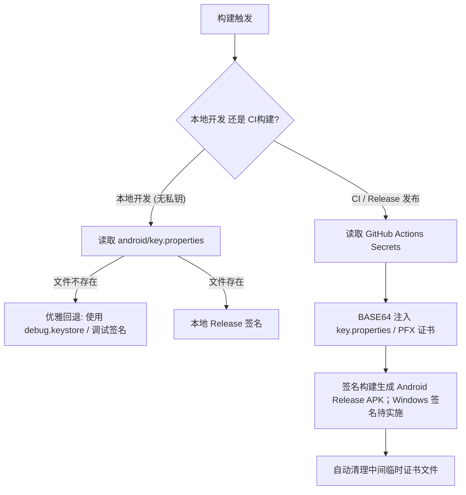

# MatrixFlow AI 全平台开源合规与发行规划（RELEASE_PLAN.md）

> 文档版本：v1.0.0  
> 生效日期：2026-09-16  
> 适用范围：MatrixFlow AI 客户端（Flutter Android + Windows 主线及 GitHub/应用商店发行）

---

## 1. 开源协议与合规授权

### 1.1 主仓库与开源协议
- **开源许可证**：本项目客户端整体采用 **MIT License**（宽松型自由开源协议）。
- **授权范围**：包含 `matrixflow-native/` 完整源码、构建与打包脚本、测试用例及配套文档。
- **商业化与 BYOK 边界**：
  - 客户端代码完全开源免费，保留用户自带密钥（BYOK, Bring Your Own Key）直连模型服务商的权利，不设置任何本地对待办数量、看板数量或基础功能的锁死与付费门槛。
  - 未来规划的 WP29 托管 AI 服务为独立运行组件（服务端代理），其商业运营与账本代码独立于开源客户端，客户端开源不影响商业服务合规性。

### 1.2 第三方依赖合规清单
MatrixFlow 客户端依赖及打包资源的核对范围、许可证与未决项见 [OS26 审计记录](OS26_NOTES.md)。下表保留主要依赖与资源摘要；传递依赖 `dbus` 为 MPL-2.0，Material Icons 字体以当前固定 Flutter SDK 的许可文件为准。

| 依赖库 / 组件 | 许可证 | 用途说明 | 合规要求 |
|---|---|---|---|
| **Flutter SDK & Dart SDK** | BSD-3-Clause | 跨平台 UI 渲染与跨端运行时 | 保留 BSD 版权声明 |
| **provider** (^6.1.2) | MIT | 全局响应式状态管理（Store/Theme） | MIT 兼容 |
| **http** (^1.6.0) | BSD-3-Clause | AI 服务商 HTTP/REST API 请求 | 保留 BSD 版权声明 |
| **shared_preferences** (^2.3.4) | BSD-3-Clause | 本地持久化存储（四键与机器偏好） | 保留 BSD 版权声明 |
| **path_provider** (^2.1.5) | BSD-3-Clause | 系统沙箱文件路径解析 | 保留 BSD 版权声明 |
| **file_picker** (^8.1.7) | MIT | 导入/导出 JSON 文件选择器 | MIT 兼容 |
| **flutter_local_notifications** (^19.5.0) | BSD-3-Clause | Android/Windows 本地定时通知与提醒 | 保留 BSD 版权声明 |
| **timezone** (^0.10.1) | BSD-2-Clause | 本地日历天与夏令时时区转换 | 保留 BSD 版权声明 |
| **Material Icons 字体** | CC-BY 4.0（固定 Flutter SDK 的 `materialicons_license.txt`） | 应用内置图标字体 | 发行前补充 Google 署名与许可链接；见 OS26 未决项 |
| **系统字体 (Noto / Roboto / Segoe UI)** | OFL / Apache 2.0 | 优先使用系统预置字体与字体偏好 | 无外部商用字体版权侵权风险 |

### 1.3 冻结 Legacy Web 归档声明
- 根目录下的 React 19 / Vite / Tauri / Capacitor 工程为历史原型与只读参考实现，已全部冻结，不再演进。
- 归档工程完整保留在根目录仓库中，与 `matrixflow-native/` 共享根目录 MIT License，对外发行说明中明确标明其为只读归档代码，避免混淆。

---

## 2. 应用元数据与标识规范

为确保跨平台发行、应用商店审核与系统集成的统一性，制定如下规范元数据：

### 2.1 统一元数据表

| 元数据项 | Android 客户端 | Windows 桌面端 | 规范说明 |
|---|---|---|---|
| **应用名称 (App Name)** | MatrixFlow AI | MatrixFlow AI | 统一展示名称，副标题为“四象限待办与智能拆解” |
| **应用标识 (Application ID / AUMID)** | `com.matrixflow.app` | `MatrixFlow.MatrixFlowApp.1.0` | 唯一反向域名/AUMID 规范 |
| **可执行文件名 / 包名** | `com.matrixflow.app` | `matrixflow_native.exe` | 规范安装包与运行时文件名 |
| **Windows 通知 GUID** | - | `6c478a0d-3bf9-4b45-a43b-74296dbcebc2` | WinRT Toast 与 AUMID 注册绑定 |
| **启动 Activity / 入口** | `.MainActivity` | `wWinMain` (Runner.rc 资源绑定) | 平台标准主入口 |
| **首发版本号 (SemVer)** | `1.0.0` (versionCode: 1) | `1.0.0.0` (ProductVersion: 1.0.0) | 统一语义化版本管理 |

### 2.2 版本号演进规范（SemVer + BuildNumber）
- **版本格式**：`MAJOR.MINOR.PATCH+BUILD`（如 `1.0.0+1`）。
- **MAJOR（主版本号）**：重大产品架构升级或不兼容持久化格式变更。
- **MINOR（次版本号）**：新增工作包能力（如日历集成、云同步等），向下兼容。
- **PATCH（修订版本号）**：Bug 修复、UI 细节调优与性能改进。
- **BUILD（构建号）**：单调递增整数，Android 映射为 `versionCode`，Windows 映射为 `FILEVERSION` 末位。

---

## 3. 签名安全与凭据隔离方案

正式 Android 发行要求外部提供签名材料并通过签名校验；缺少材料时发行脚本和工作流拒绝生成正式产物。Windows 当前只生成未签名绿色包。下图记录目标流程，PFX Windows 签名步骤尚未实施：



### 3.1 Android 签名隔离规范
1. **配置文件**：`matrixflow-native/android/key.properties`（已加入 `.gitignore` 严禁提交）。
2. **格式规范**：
   ```properties
   storePassword=<SECURE_STORE_PASSWORD>
   keyPassword=<SECURE_KEY_PASSWORD>
   keyAlias=matrixflow-release
   storeFile=matrixflow-release.jks
   ```
3. **安全回退机制**：
   - 无 `key.properties` 的开发和测试构建可继续；正式发行设置 `REQUIRE_RELEASE_SIGNING=true`，缺签名必须失败。不能把 debug 签名 APK 作为正式发行包。
4. **CI 自动化注入**：
   - CI 环境通过环境变量 `ANDROID_KEYSTORE_BASE64`、`ANDROID_KEY_ALIAS`、`ANDROID_KEY_PASSWORD`、`ANDROID_STORE_PASSWORD` 动态生成临时签名文件，构建完成后立即删除。

### 3.2 Windows 代码签名规范
1. **开源首发阶段**：提供发布物料的 **SHA256 校验和清单**（`SHA256SUMS.txt`）以及完整的 GitHub Release 发行。
2. **企业/正式发行阶段**：
   - 接入 Sectigo / DigiCert 代码签名证书（.pfx）。
   - CI 构建流利用 `signtool.exe` 对可执行文件及 DLL 动态库实施双重时间戳（RFC 3161）签名。

---

## 4. 全渠道发布矩阵与上架准备

| 渠道类别 | 渠道名称 | 交付产物 | 审核/上架资质要求 | 准备就绪状态 |
|---|---|---|---|---|
| **开源与开发者** | **GitHub Release** | `matrixflow-v1.0.0+1-android.apk`<br>`matrixflow-v1.0.0+1-windows-portable.zip`<br>`SHA256SUMS.txt` | • GitHub 仓库公开<br>• 正式 Android 签名<br>• 完整源码与免责声明 | **待托管身份、签名与发布验收** |
| **Android 极客社区** | **酷安 (Coolapk)** | Release APK | • 开发者实名认证<br>• 应用图标、截图<br>• 隐私政策规范 | **未提交，待发行材料** |
| **国内主流商店** | **小米应用商店** | Release 64位 APK | • 企业/个人开发者认证<br>• 权限合法合规说明 | **未提交，资质待核** |
| **国内主流商店** | **华为应用市场** | Release 64位 APK | • 华为开发者认证<br>• 隐私合规审核<br>• 包体测试报告 | **未提交，资质待核** |
| **Windows 渠道** | **GitHub 绿色便携包** | ZIP 压缩归档（免安装解压即用） | • 附带哈希校验<br>• 如实披露未签名状态 | **本地构建已测，托管发行未测** |
| **Windows 商店** | **Microsoft Store** | MSIX 桌面包 | • 微软开发者个人/企业账户 ($19一次性)<br>• Partner Center 送审包 | 后续路线演进 |

---

## 5. 隐私安全与 BYOK 纯本地合规规范

MatrixFlow 坚持**用户主权与绝对隐私**原则，并在应用商店送审与开源物料中做如下合规保证：

1. **100% 本地优先（Local-First & Offline-Ready）**：
   - 所有任务数据、四象限分类、子任务、历史统计数据、自定义看板全部保存在设备本地 `SharedPreferences`。
   - 应用无默认后台服务器、无外部用户数据库、不支持也不强制任何注册登录。
2. **BYOK（Bring Your Own Key）直连模式**：
   - 用户填写的 API Key 仅在本地持久化，并在发起 AI 分类/拆解时直接与用户配置的服务商（如 DeepSeek 官方接口、火山引擎或阿里云百炼）建立端到端加密通信（HTTPS）。
   - 客户端绝无任何收集、中转、分析或转发用户密钥与待办内容至任何第三方中央服务器的后门逻辑。
3. **零遥测、零埋点、零第三方 SDK**：
   - 不集成任何商业广告 SDK、分析追踪 SDK（无友盟、TalkingData、Firebase Analytics、Google Analytics 等）。
   - 用户对待办的管理完全静默，不上传任何操作行为日志。
4. **权限最小化与合规使用**：
   - `INTERNET`：仅在用户触发 AI 功能或动态拉取模型列表时访问目标端点；纯本地待办离线完全可用。
   - `POST_NOTIFICATIONS`：用于向用户呈现设定的待办截止与自定义时间提醒。
   - `SCHEDULE_EXACT_ALARM`：用于在指定时间点准时触发提醒通知。
   - `RECEIVE_BOOT_COMPLETED`：用于设备重启后重新排期已有的有效未完成提醒。
   - `VIBRATE`：用于提醒触发与任务手势操作轻触觉反馈。
   - **严格杜绝 `USE_EXACT_ALARM`**：严格避免非白名单应用滥用强闹钟权限导致 Google Play / 国内各大应用商店违规拒审。
