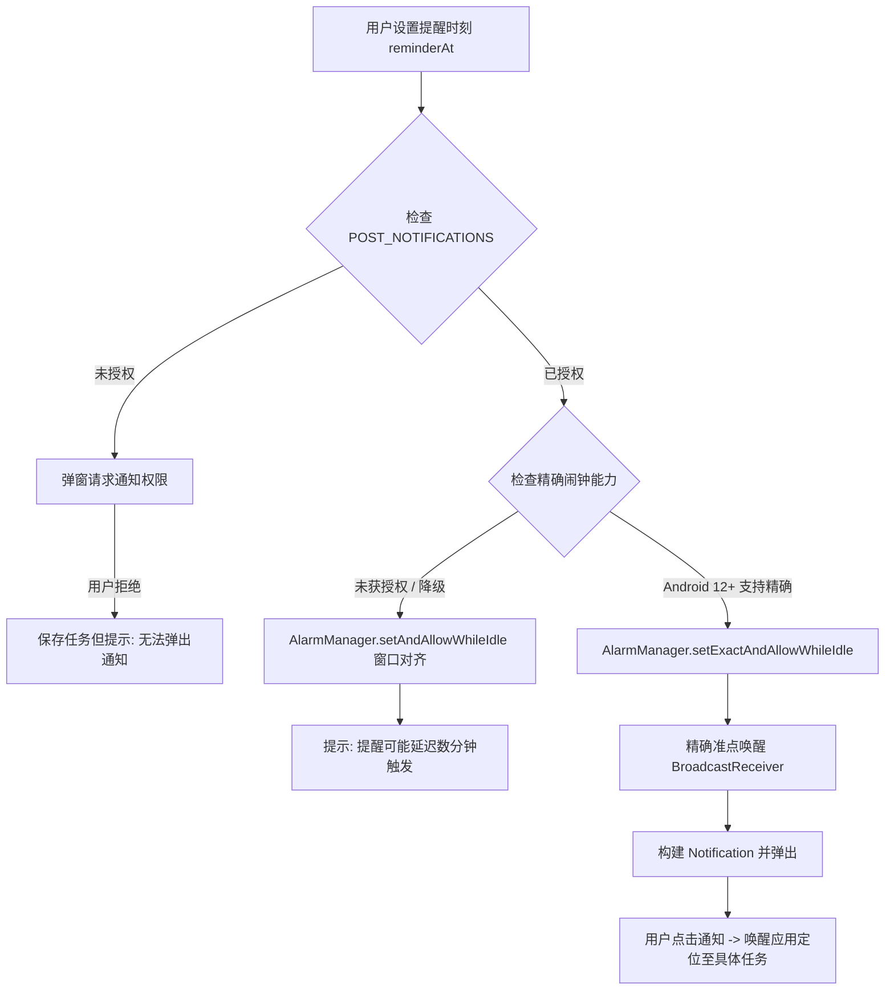

# MatrixFlow AI: 本地日期时间提醒与通知技术契约与架构设计规范 (REMINDERS_DESIGN.md)

> 本文档依据 `docs/IMPLEMENTATION_PLAN_2026-09-08.md` 中 **WP25-R**（本地日期时间提醒研究与契约）要求制定。
> 梳理 Android 精确闹钟权限、厂商后台限制、Windows 桌面托盘与通知联动、三维日期语义解耦、数据演进契约以及跨平台统一服务接口定义。

---

## 1. 背景、核心原则与设计边界

### 1.1 需求背景（MF39）
MatrixFlow AI 作为 AI 驱动的四象限个人任务管理应用，用户在日常使用中需要针对重要任务（特别是 Q1 紧急且重要、Q2 不紧急但重要）或具体的子任务设置**到点响铃/推送提醒**，以便在未打开应用时亦能及时处理待办。

### 1.2 核心原则与设计边界
1. **100% 纯本地、无远程服务器（Local-First & Offline-First）**：
   - 不依赖 Firebase Cloud Messaging (FCM)、APNs 或任何自建远程推送服务器；
   - 所有提醒的设置、调度、触发与销毁完全在宿主设备本地执行，零数据上报，零隐私泄露；
   - 无网络连接、离线、飞行模式下，本地提醒调度功能完备无损。
2. **轻量非侵入、严禁恶性后台常驻（No Rogue Background Daemon）**：
   - 坚决**不**引入带有常驻常显“正在运行”前台服务（Sticky Foreground Service Notification）的电池黑洞设计；
   - 坚决**不**使用一像素透明 Activity、无声音乐循环播放等已被现代 Android 系统封禁的流氓保活手段；
   - 依托操作系统原生提供的定时唤醒机制（Android `AlarmManager` 与 Windows 托盘生命周期），做省电、规矩、透明的开源应用。
3. **三维时间语义彻底解耦（Orthogonal Date Decoupling）**：
   - 很多传统待办软件将“截止日期”与“提醒时间”混为一谈，导致逻辑混乱。MatrixFlow 严格区分三类独立时间字段：
     - **截止日（`deadline`）**：目标完成截止日，按本地日历天午夜对齐计算（`deadline_policy.dart`），用于象限自动升级（Q2→Q1、Q4→Q3）、逾期判定与视觉指示；
     - **提醒时刻（`reminderAt`）**：具体分钟级时间戳（毫秒级 Epoch），由用户显式选择到点唤醒。**设置截止日绝对不强行开启提醒，设置提醒也绝对不伪造或覆盖截止日**；
     - **计划日（`plannedDate`）**：供后续 WP14 Today 页面与 WP15 Planner 日程排期使用，与上述两者正交独立。
4. **主/子任务对等独立支持**：
   - 父任务（`Task`）与子任务（`SubTask`）均拥有可空的 `reminderAt` 属性；
   - 子任务可在不同于父任务的时刻独立提醒（例如父任务“准备技术方案”截止周五，子任务“收集竞品资料”提醒在周二上午）。

---

## 2. 平台权限体系与系统限制深度梳理

### 2.1 Android 平台权限与调度机制

Android 系统自 Android 6.0 引入 Doze Mode（低电耗模式），至 Android 12/13/14 逐步收紧后台广播与精确闹钟权限。MatrixFlow 必须针对现代 Android 版本做精确适配。



#### 2.1.1 权限声明清单与用途
在 `matrixflow-native/android/app/src/main/AndroidManifest.xml` 中需增补的权限声明：

| 权限名称 | 最低 API | 权限类型 | 用途与策略 |
|---|---|---|---|
| `android.permission.POST_NOTIFICATIONS` | API 33 (Android 13) | Runtime 运行时权限 | 发送用户可见的通知。用户进入提醒配置或首次保存带提醒任务时触发申请；若被拒绝，应用友好降级，不阻断任务保存。 |
| `android.permission.SCHEDULE_EXACT_ALARM` | API 31 (Android 12) | 特殊权限 (Normal/Special) | 允许应用使用精确到秒的定时闹钟唤醒。Android 13+ 上需通过 `canScheduleExactAlarms()` 检查；若为 false，引导用户跳转系统“闹钟和提醒”设置页授权。 |
| `android.permission.RECEIVE_BOOT_COMPLETED` | API 1 | Normal 普通权限 | **必须声明**。设备关机重启或系统更新后，系统 `AlarmManager` 队列会被全量清空。需注册开机广播接收器重新排程未过期的提醒。 |
| `android.permission.VIBRATE` | API 1 | Normal 普通权限 | 允许通知发出轻度震动反馈。 |

> [!WARNING]
> **关于 `USE_EXACT_ALARM` 的合规红线**：
> Android 13 虽引入了自动授予的 `USE_EXACT_ALARM`，但 **Google Play 官方政策**（Google Play Policy on Exact Alarms）有极严苛限制：仅允许核心功能必须为“闹钟应用”、“秒表/计时器”或“日程日历”的应用使用该权限。普通待办类（Task/ToDo）若在应用商店申报该权限，会被审核驳回或下架。因此，MatrixFlow 坚持声明 `SCHEDULE_EXACT_ALARM` 并做无权限时的优雅降级（Inexact Window Alarm），确保全球开源发行与合规上架双保险。

#### 2.1.2 调度 API 与休眠穿透（Doze Mode）
- **推荐 API**：`AlarmManager.setExactAndAllowWhileIdle(AlarmManager.RTC_WAKEUP, triggerAtMs, pendingIntent)`；
- 在设备处于深度睡眠（Doze Mode）时，该 API 能穿透休眠窗口进行准点触发；
- **降级路径**：若用户关闭了“精确闹钟”权限，回退调用 `setAndAllowWhileIdle`，依靠系统维护窗口触发（允许 5–15 分钟合理误差），并在界面温和告知“已降级为节电提醒模式”。

#### 2.1.3 开机与时区恢复契约
- 声明 `BootReceiver` 监听以下系统广播：
  - `android.intent.action.BOOT_COMPLETED`
  - `android.intent.action.MY_PACKAGE_REPLACED`
  - `android.intent.action.TIMEZONE_CHANGED`
  - `android.intent.action.TIME_SET`
- 广播触发后，轻量调起后台 Worker/Service，遍历本地 `matrixflow-tasks`，将当前时间之后（`reminderAt > now`）的所有未完成任务重新注入 `AlarmManager`。

#### 2.1.4 国内主流厂商后台深度限制与应对策略（MIUI/HyperOS/EMUI/ColorOS）
国内手机厂商系统（如小米 MIUI/HyperOS、华为 HarmonyOS、OPPO ColorOS、vivo OriginOS）具备激进的“后台冻结”与“自启动限制”。
- **客观事实**：如果用户未开启“自启动”权限或开启了“极端省电”，设备进入深睡锁屏数小时后，即使系统广播也可能被厂商系统拦截。
- **正向解法**：
  1. 不使用黑科技对抗系统，而是提供**透明、友好的指引页面**（设置 -> 提醒与通知 -> “确保准时提醒设置指引”）；
  2. 根据设备厂商（通过 `android.os.Build.MANUFACTURER` 识别）动态给出步骤图文：
     - **小米 / Redmi**：打开【应用设置】->【自启动管理】-> 允许 MatrixFlow 自启动；在【省电策略】中设为【无限制】；
     - **华为 / 荣耀**：打开【电池】->【应用启动管理】-> 关闭自动管理，开启【允许自启动】与【允许后台活动】；
     - **OPPO / vivo**：打开【应用管理】-> 开启【允许自启动】与【允许完全后台行为】。

---

## 2.2 Windows 桌面平台通知与托盘联动契约

Windows 桌面环境下，待办提醒的体验取决于应用进程的生命周期与 Windows 系统的通知中心交互。

```mermaid
flowchart TD
    W1[设置 Windows 提醒] --> W2{检测应用运行状态}
    W2 -- 窗口前台可见 --> W3[应用内横幅 + WinRT Toast 提示音]
    W2 -- 最小化到系统托盘 (WP26-B) --> W4[后台计时器触发 WinRT Toast 通知]
    W4 --> W5[用户点击桌面 Toast]
    W5 --> W6[调用 DesktopShellService.restoreWindow()]
    W6 --> W7[前台展现 MatrixFlow 并打开对应任务详情]
    W2 -- 应用完全彻底退出 (无托盘) --> W8[进程终止，无法触发提醒]
    W8 --> W9[界面设置与提示引导: 建议开启最小化到托盘]
```

#### 2.2.1 依赖 WP26-B 托盘生命周期
- 在 WP26-B-N-Windows 中，MatrixFlow 已实现完整的 `DesktopShellService` 与“关闭到托盘（`closeToTray`）”选项；
- **核心契约**：
  - 当 `closeToTray: true` 时，用户点击窗口关闭按钮（X），应用窗口隐藏并驻留在系统托盘；
  - 内存中的 Dart Isolate 与后台轻量调度计时器继续保持活性；
  - 调度到达预定时刻时，触发 Windows 原生 **WinRT Toast Notification**（操作中心横幅）；
  - 用户点击 Toast 通知横幅后，操作系统通知回调触发 `DesktopShellService.instance.restoreWindow()`，主窗口重新置顶并高亮定位目标任务。
- **用户透明说明**：
  - 在 Windows 设置项下明确提示：“在桌面端，请保持【关闭时最小化到系统托盘】开启，以确保后台能按时弹出待办提醒”。若用户彻底选择“退出程序”，则进程终止。

#### 2.2.2 Windows 专注助手（Focus Assist / 免打扰）
- WinRT 通知自动尊重 Windows 系统的“专注助手”策略；
- 在游戏、全屏演示或免打扰时段，通知静默存入操作中心，不强行抢夺用户焦点与全屏输入。

---

## 3. Flutter 生态通知插件选型与评估

我们对 Flutter 跨平台生态中维护良好的本地通知插件进行了可行性、跨平台支持及打包体积的对比评估：

| 候选方案 | Android 支持 | Windows 支持 | 优点 | 缺点 / 风险 | 选型建议 |
|---|---|---|---|---|---|
| **A. `flutter_local_notifications` (v18+)** | 极佳 (AlarmManager、精准闹钟、通道、前后台路由完整) | 良好 (已提供 Windows 原生 WinRT/Toast 实现) | Flutter Favorite 官方认证库，社区最庞大，开箱即用支持 Android 13/14 权限与广播，跨端统一 Dart API | 依赖较多平台代码，打包体积略有增加 | **首选核心方案** (用于 Android 全量特性及 Windows 跨端基座) |
| **B. `local_notifier` (LeanFlutter)** | 基础 (仅即时通知，无内置定时调度) | 极佳 (深度定制 WinRT 桌面横幅与按钮) | 专注于 Desktop (Windows/macOS/Linux)，接口极为轻量清爽 | Android 缺少定时调度与 BootReceiver，需额外补充实现 | 仅作 Windows 备选方案 |
| **C. 自研 Platform Channel** | 需手写原生 Java/Kotlin 调度 | 需手写 C++ WinRT Toast | 极致轻量，零第三方依赖 | 重复造轮子，维护 Android 12-14 各种版本碎片化成本极高 | 放弃 |

### 选型结论
**主选 `flutter_local_notifications`**。
在 `matrixflow-native/lib/services/` 下封装抽象的 `ReminderService` 接口，将底层插件调用与业务层解耦，UI 和 `storage.dart` 仅面向 `ReminderService` 编程，隔离平台实现细节。

---

## 4. 数据模型契约与数据兼容演进规范 (WP11/WP13/WP25)

遵循 `docs/DATA_COMPATIBILITY.md` 与 WP11-N 的数据演进契约，新增字段必须具备明确的缺省兜底、v2 序列化、v1 降级剥离以及双端往返能力。

### 4.1 模型字段定义与扩展

#### (1) `Task` 模型扩展
```dart
class Task {
  // ... 已有字段: id, boardId, title, quadrant, completed, deadline,
  // longTerm, subtasks, createdAt, reasoning, urgencyMode, notesMarkdown
  
  /// 明确的本地提醒时间戳 (毫秒级 Epoch UTC 时间戳)。
  /// 为 null 表示未设置提醒。
  int? reminderAt;

  /// 可选的时区标识 (例如 "Asia/Shanghai" 或 "UTC+8")，
  /// 用于跨时区场景下的夏令时判定与本地习惯维持。
  String? reminderTimezone;
}
```

#### (2) `SubTask` 模型扩展
```dart
class SubTask {
  // ... 已有字段: id, title, completed, deadline, notesMarkdown
  
  /// 子任务独立的本地提醒时间戳。
  int? reminderAt;
}
```

#### (3) `AppSettings` 用户偏好扩展
```dart
class AppSettings {
  // ... 已有设置: language, hideCompleted, confirmTaskDelete,
  // urgencyThresholdDays, viewMode, fontSize, fontFamily, closeToTray, globalShortcut ...
  
  /// 默认提前提醒偏好 (单位: 分钟)
  /// 0 = 准时提醒; 5 = 提前5分钟; 15 = 提前15分钟; 60 = 提前1小时; 1440 = 提前1天
  int defaultReminderAdvanceMinutes;

  /// 提醒是否播放声音
  bool reminderSound;

  /// 提醒是否震动
  bool reminderVibrate;
}
```

### 4.2 序列化与数据兼容矩阵

| 载荷版本 | `reminderAt` 处理规则 | 说明 |
|---|---|---|
| **ExportData v2**（标准） | 当 `reminderAt != null` 时完整输出为整数时间戳 | 正常持久化，跨端导出再导入 100% 保留提醒时间。 |
| **ExportData v1**（降级） | **主动剥离剔除** `reminderAt` 与 `reminderTimezone` | 降级导出给旧版客户端时，不破坏旧版 JSON 结构，弹出字段丢失提示。 |
| **反序列化读取** | 容错读取：若键不存在或格式损坏，安全回退兜底为 `null` | 兼容旧版没有任何提醒字段的历史数据与备份。 |

---

## 5. 调度生命周期、状态机与级联取消契约

本地提醒必须与任务的主生命周期严格同步，严防出现“任务已完成/已删除但闹钟依然响个不停”的恶性体验事故。

### 5.1 通知 ID 稳定映射算法（31 位无符号整型）
Android 原生 `NotificationManager` 与 `PendingIntent` 请求码要求传入 32 位整型（int）。MatrixFlow 的任务 ID 是随机生成的字符串（例如 `mf-1726322400000-0-987654`）。

为保证同一任务在修改、取消时映射到完全一致的系统通知 ID，采用标准的 **FNV-1a 31 位哈希算法**：

```dart
/// 为任务或子任务计算确定性的 31 位非负整数通知 ID，杜绝跨任务冲突。
int generateNotificationId(String taskId, {String? subtaskId}) {
  final compositeKey = subtaskId == null ? 'task_$taskId' : 'sub_${taskId}_$subtaskId';
  var hash = 0x811c9dc5;
  for (var i = 0; i < compositeKey.length; i++) {
    hash ^= compositeKey.codeUnitAt(i);
    hash = (hash * 0x01000193) & 0x7fffffff;
  }
  return hash;
}
```

### 5.2 状态流转与级联取消动作表

| 用户/系统触发动作 | 涉及模块 | 本地存储动作 | 系统级调度动作（ReminderService） |
|---|---|---|---|
| **新建带提醒任务** | `InputSheet` / `TaskDetailPanel` | 写入 `task.reminderAt` | 若时刻在未来，计算 ID 并调用 `scheduleReminder()`。 |
| **修改提醒时刻** | `TaskDetailPanel` | 更新 `task.reminderAt` | 先调用 `cancelReminder(oldId)`，再排程 `scheduleReminder(newId)`。 |
| **清除提醒时刻** | `TaskDetailPanel` | 置 `task.reminderAt = null` | 调用 `cancelReminder(id)` 销毁系统队列。 |
| **勾选任务完成** | `TaskCard` / `TaskDetailPanel` | 置 `task.completed = true` | **即时调用** `cancelReminder(id)`，取消系统排程；同时级联取消其所有子任务的排程。 |
| **反选任务恢复未完成** | `TaskCard` / `CompletedScreen` | 置 `task.completed = false` | 若原 `reminderAt` 仍处于**未来**时刻，重新自动排程；若已在**过去**，静默保持，不触发补响。 |
| **单任务删除** | 滑动删除 / 详情面板删除 | 从待办数组中移除 | 调用 `cancelReminder(id)` 及其所有子任务的取消命令。 |
| **撤销删除（WP24-N Undo）** | 5秒 SnackBar 点击撤销 | 恢复任务到待办列表 | 若 `reminderAt` 仍在未来，恢复其系统排程。 |
| **一键清空看板（WP02-N）** | 看板操作菜单 | 删除该 board 下所有任务 | 调用 `cancelAllForBoard(boardId)`，批量注销该看板下所有主子任务排程。 |
| **删除看板** | 看板管理 | 删除看板实体及其所有任务 | 调用 `cancelAllForBoard(boardId)`。 |
| **导入覆盖备份（WP11-N）** | 数据设置 -> 导入 JSON | 原子覆盖本地任务库 | 先执行 `cancelAll()` 清空全部排程，遍历导入后的未完成任务并对未来的 `reminderAt` 重新排程。 |

### 5.3 跨期与过期处理规则（不产生通知轰炸）
- **过去时刻拦截**：界面日期选择器禁止将新提醒时刻设在当前时间之前（必须 `triggerAtMs > DateTime.now().millisecondsSinceEpoch`）。
- **过期补发抑制契约（首版契约）**：
  - 若手机关机数日，在此期间有 10 个提醒本应响起；
  - 开机后或应用冷启动后，**严格不自动狂弹 10 条过期通知**；
  - **规则**：仅当提醒时间落在 `(now - 5分钟, now]` 这一短暂窗口内时，才作为轻度近时通知提醒一次；任何早于 `now - 5分钟` 的历史提醒，静默保留数据记录，系统调度队列直接弃用跳过。

---

## 6. Dart 抽象服务接口定义 (`reminder_service.dart`)

为保证 WP25-N-Android 与 WP25-N-Windows 的代码整洁度与高可测性，定义如下核心抽象接口类：

```dart
import 'package:flutter/foundation.dart';
import '../models.dart';

/// 提醒权限与可用性状态枚举
enum ReminderPermissionStatus {
  /// 权限已完全授予 (含通知权限与精确闹钟权限)
  granted,
  /// 缺少通知权限 (用户拒绝 POST_NOTIFICATIONS)
  denied,
  /// 具备普通通知权限，但精确闹钟受限 (Android 12+ Inexact 降级)
  inexactOnly,
  /// 平台不支持提醒
  unsupported,
}

/// 提醒通知意图载荷 (用于从通知点击跳转至原任务)
class ReminderPayload {
  final String boardId;
  final String taskId;
  final String? subtaskId;

  const ReminderPayload({
    required this.boardId,
    required this.taskId,
    this.subtaskId,
  });

  Map<String, dynamic> toJson() => {
    'boardId': boardId,
    'taskId': taskId,
    if (subtaskId != null) 'subtaskId': subtaskId,
  };

  factory ReminderPayload.fromJson(Map<String, dynamic> json) => ReminderPayload(
    boardId: json['boardId'] as String,
    taskId: json['taskId'] as String,
    subtaskId: json['subtaskId'] as String?,
  );
}

/// 跨平台本地提醒调度服务抽象接口
abstract class ReminderService {
  static ReminderService? _instance;
  static ReminderService get instance => _instance ?? NoopReminderService();
  static set instance(ReminderService service) => _instance = service;

  /// 初始化服务并绑定通知点击回调
  Future<void> init({
    required void Function(ReminderPayload payload) onNotificationSelected,
  });

  /// 检查当前提醒与通知权限状态
  Future<ReminderPermissionStatus> checkPermission();

  /// 请求必要的用户权限 (Android 13+ 弹窗请求 POST_NOTIFICATIONS)
  Future<bool> requestPermission();

  /// 排程单项提醒
  Future<void> scheduleReminder({
    required String boardId,
    required String taskId,
    String? subtaskId,
    required String title,
    String? body,
    required int triggerAtMs,
    bool sound = true,
    bool vibrate = true,
  });

  /// 取消单项提醒
  Future<void> cancelReminder(String taskId, {String? subtaskId});

  /// 取消指定看板下的全部任务提醒
  Future<void> cancelAllForBoard(String boardId, List<Task> tasksOnBoard);

  /// 取消系统中的全部提醒调度 (导入覆盖时使用)
  Future<void> cancelAll();

  /// 重新排程全量未来提醒 (开机恢复、时区变更、导入后重新注入)
  Future<void> rescheduleAllFuture(List<Task> allTasks);
}

/// 默认的空实现 (用于非支持平台或测试模拟)
class NoopReminderService implements ReminderService {
  @override
  Future<void> init({required void Function(ReminderPayload payload) onNotificationSelected}) async {}

  @override
  Future<ReminderPermissionStatus> checkPermission() async => ReminderPermissionStatus.granted;

  @override
  Future<bool> requestPermission() async => true;

  @override
  Future<void> scheduleReminder({
    required String boardId,
    required String taskId,
    String? subtaskId,
    required String title,
    String? body,
    required int triggerAtMs,
    bool sound = true,
    bool vibrate = true,
  }) async {}

  @override
  Future<void> cancelReminder(String taskId, {String? subtaskId}) async {}

  @override
  Future<void> cancelAllForBoard(String boardId, List<Task> tasksOnBoard) async {}

  @override
  Future<void> cancelAll() async {}

  @override
  Future<void> rescheduleAllFuture(List<Task> allTasks) async {}
}
```

---

## 7. 后续实施阶段细分与验证用例设计

根据总规划，WP25 拆分为后续两个平台原生实施小包：

### 7.1 WP25-N-Android 实施任务拆解
1. **依赖与配置**：
   - 在 `matrixflow-native/pubspec.yaml` 引入 `flutter_local_notifications`；
   - 更新 `AndroidManifest.xml`：配置 `POST_NOTIFICATIONS`、`SCHEDULE_EXACT_ALARM`、`RECEIVE_BOOT_COMPLETED` 与通知图标资源；
   - 实现 Android 原生 `BootReceiver` 监听系统启动广播。
2. **模型与存储接线**：
   - 扩展 `Task` / `SubTask` 增加 `reminderAt` 字段，遵循 WP11 v2 导出与 v1 降级；
   - 在 `storage.dart` 中实现与 `ReminderService` 联动（增改删、完成、清空看板、导入覆盖）。
3. **UI 交互与提示**：
   - 在任务详情面板（`TaskDetailPanel`）与新建面板（`InputSheet`）中增加“提醒时刻”选择器（提供准时、提前 10 分钟、选择具体时间及清除按钮）；
   - 权限缺失时展示友好说明气泡；
   - 在设置界面中提供“提醒保活与通知指南”。

### 7.2 WP25-N-Windows 实施任务拆解
1. **Windows 原生集成**：
   - 适配 Windows 平台的通知初始化与 WinRT Toast 模板；
   - 整合 `DesktopShellService` 的最小化到托盘状态，确保后台隐藏状态下准时弹出横幅；
   - 捕获点击 Toast 事件唤起主窗口并传递 `ReminderPayload`。
2. **Windows 交互与设置**：
   - 在设置中说明托盘驻留对提醒的必要性；
   - 验证高 DPI 屏幕与深浅色模式下的 Windows 通知展现。

### 7.3 自动化测试设计清单（供下一轮开发使用）
- [x] **数据模型与兼容性测试**：
  - `reminderAt` 字段序列化、反序列化、v1 降级剥离、缺失字段默认 null 测试；
- [x] **ID 哈希确定性测试**：
  - 验证同一 `taskId` 生成的 31 位通知 ID 稳定且无负数；
  - 验证父任务与子任务即便 ID 相似也不会发生 ID 碰撞；
- [x] **级联取消逻辑测试**：
  - 完成任务触发取消；
  - 恢复任务在未来重新排程、过去不补发；
  - 删除任务及一键清空看板触发取消；
  - 导入覆盖触发全量重建。
